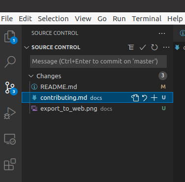
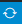
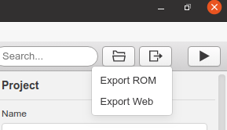
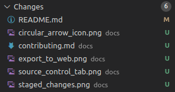
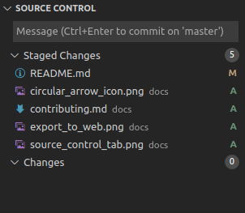
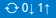

# How to Contribute to This Project

*Note: for now it's just two people working on this, but if anyone else on the internet wants to help, let me know and we can actually do things properly with pull requests and such.*

## Download files

First, [install git](https://git-scm.com/book/en/v2/Getting-Started-Installing-Git).

Then, find somewhere to put the game files, e.g. your Documents folder.

[Open a terminal there](https://towardsdatascience.com/a-quick-guide-to-using-command-line-terminal-96815b97b955), and type 
`git clone https://github.com/callum-mccracken/Take_the_Monet_and_Run.git` to create a local copy of the game files online (a "clone" of the "repository").

Now you should see a folder called `Take_the_Monet_and_Run` containing all game files.

## Edit files

Use [GBStudio](https://www.gbstudio.dev/printable/) for editing the game itself, e.g. adding collisions or scenes.

I recommend using [VSCode](https://code.visualstudio.com/) for editing docs and such. Open the `Take_the_Monet_and_Run` folder in VSCode.

Also recommended: [GIMP](https://www.gimp.org/) for pixel art (see [this video](https://www.youtube.com/watch?v=oAaoh49yf5A)).

If you are using VSCode, take note of the Source Control tab on the left.

If not, you're going to have to learn how to use the [git command line interface](https://git-scm.com/doc).

I will assume you're using VSCode for the rest of this file.

## By the way, make sure you have the latest files

If you cloned the repository a while ago, make sure your files are up to date!

There's an icon in the bottom left of the screen which should look like this:

If it looks like an arrow up and an arrow down with a numer beside each arrow (see last pic in this doc), click it and it will download the latest files, and then look like the circular arrow above.

## Save all your files and export to web

When you're done (or at a good point to save anyway), "Export to web" by hitting the button in the top right of GBStudio. This creates files that are used to make the [web version of the game](https://callum-mccracken.github.io/Take_the_Monet_and_Run/build/web/).

## Then commit changes

"Commit" is the git word for "add your changes to your local repository". You'll have to "stage" your files (specify which files to commit) and enter a "commit message" (short text explaining changes) before you can commit.

For example, you see these files I have saved to my local computer, under "Changes"?

I haven't staged them yet. To stage them, press the plus sign beside each file you want to stage, or the plus sign that appears beside the "Changes" header when you scroll over it if you want to stage *all* changes.

Once doing that, your tab should look like this:

Then enter a commit message, something like "updated street image for Paris scene" or "updated docs" (keep it short and sweet), and hit Ctrl+Enter to commit.

## And finally, push them online

Assuming the commit step went well, your changes are now saved to your local computer's git repository, and are ready to be "pushed" or uploaded to the main repository online. To do that, use that sync button in the bottom left of VSCode, the circular arrow button from earlier, which should now be one up arrow and one down arrow.

The number 1 beside the up arrow means you have one commit to push, and you should hopefully see a 0 beside the down arrow meaning there are zero commits to pull.

Once the icon is back to a circular arrow, you have pushed your changes! Congrats! 

Check the [online game](https://callum-mccracken.github.io/Take_the_Monet_and_Run/build/web/) to make sure everything uploaded properly.